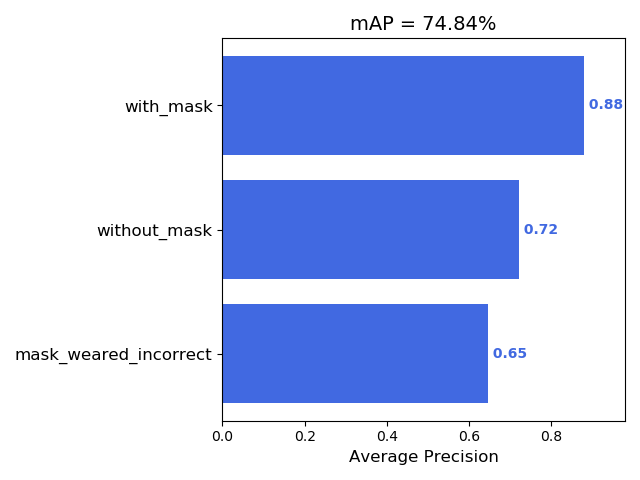
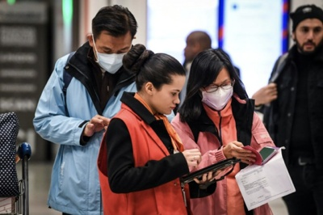
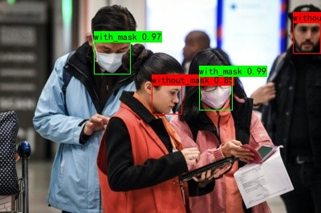

# RetinaNet-Object-Detection

## 安裝環境   
```
pip install -r requirements.txt
```

## 資料準備
在開始訓練之前，先檢查自己的dataset當中的圖片和label(xml檔)已經按照Pascal VOC格式整理，並放置在VOCdevkit資料夾下。 

### step1 : 生成訓練用的標註文件
##### 注意參數 
VOCdevkit_path:這次要訓練的dataset  
classes_path:要對到一個txt檔 裡面是訓練資料的所有類別  
trainval_percent : (train+val):(test) 的比例  
train_percent:在(train+val)當中，train : val 的比例
```
python voc_annotation.py
```
會根據準備的圖片和標註資料生成相應的訓練用txt檔。

### step2 : 訓練模型
##### 注意參數 
classes_path:要對到一個txt檔 裡面是訓練資料的所有類別  
model_path:模型權重檔位置
```
python train.py
```
每個epoch訓練完的權重檔都會存在根目錄下的 logs 資料夾裡面

### step3 : 評估模型
```
python get_map.py
```
計算各個類別的平均精度（AP）以及最終計算出的mAP  

### step4 : 預測
##### 注意參數 
classes_path:要對到一個txt檔 裡面是訓練資料的所有類別  
model_path:模型權重檔位置  
dir_origin_path:要預測的圖片位置
```
python predict.py
```
input:  


output:  



